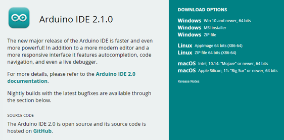
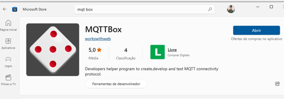
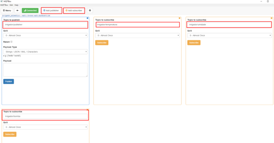
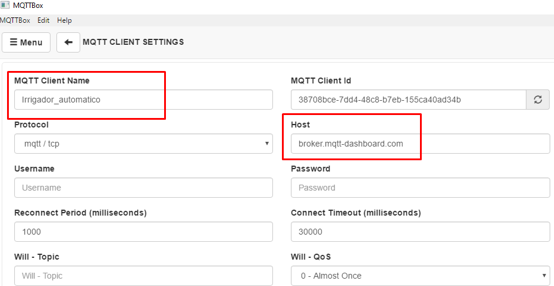
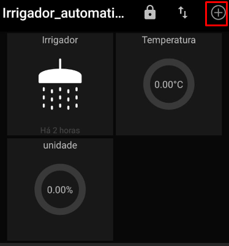

# Automatic_Irrigator
projeto do curso de análise e desenvolvimento de sistemas da Universidade Presbiteriana Mackenzie

# Configuração do projeto

você pode testar utilizando a ferramenta Arduino IDE  

<https://www.arduino.cc/en/software> Disponível
Ir em file > new scketch
E inserir seu código
 

1.	Criação e configuração do MQQTBox 
Dispositivo Android
Baixar o aplicativo ‘MQQTBox’ na Microsoft store

 

<https://apps.microsoft.com/store/apps?hl=pt-br&gl=BR&rtc=1>

Abra o aplicativo ‘MQQTBox’ e preencha os campos destacados em vermelho assim como esta na imagem abaixo, somente o host você irá precisar criar um host com dados de sua rede
 
2.	Para criar um host você pode obter um na https://console.hivemq.cloud/

<https://console.hivemq.cloud/>

E configure dessa forma o Publisher e os subriscribes

3.	Instalar e configurar o ‘MQTT Dash’

<https://play.google.com/store/games?device=windows&&utm_source=latam_Med&utm_medium=hasem&utm_content=Dec1622&utm_campaign=Evergreen&pcampaignid=MKT-EDR-latam-br-1000189-Med-hasem-py-Evergreen-Dec1622-Text_Search_BKWS-id_102355_%7CEXA%7CONSEM_kwid_43700074755585164&gclid=CjwKCAjwgqejBhBAEiwAuWHioDKH-mxY7kTQOtVkKguQNpTCXmxvU_jpjAkgTJn16rk--H8cey9rwRoCmbgQAvD_BwE&gclsrc=aw.ds>

certifique de que o nome e o address estão iguais ao configurado no MQQTBox

 

4.	Configure o sensor de umidade a bomba e o irrigador
 
 